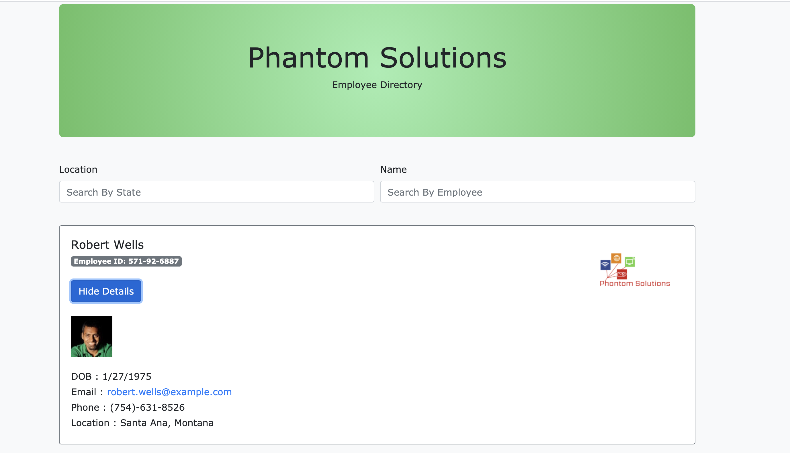

#       Employee Search Directory 

#       Description

This project simulates an application that allows the user to search for all employees within their company. Search results can be narrowed down by either searching for a specific employee by name, or search for all the employees that are located in a specific state. All employee cards display the employees' name, email, phone, employee ID, and DOB.

#       Images

#       Technologies Used

* Create React App
* gh-pages
* JSX
* HTML
* CSS
* Bootstrap
* Random User API: https://randomuser.me/api/

#      Dependencies 

* axios
* react-bootstrap

#       Installation 

* Clone the repo link to your local computer
* Open your intergraded CLI
* Run npm install
* Run npm start

#       Contributors 

* Marisa Hanna

#       Link To Live Application 

[https://marisahanna.github.io/phantom-directory/](https://marisahanna.github.io/phantom-directory/)

